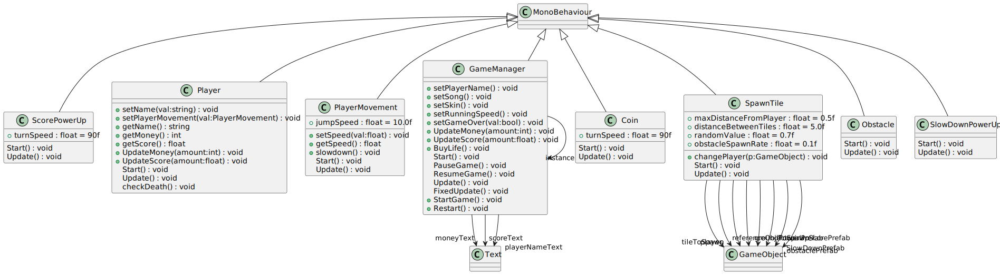

# ProiectMDS

## User stories

* Ca utilizator, vreau sa imi scriu numele, care va ramane de la un joc la altul, pastrand scorul meu maxim.
* Ca utilizator, vreau sa am un sistem de notare al scorului in functie de performanta mea in joc.
* Ca utilizator, vreau sa imi aleg un nivel de dificultate (viteza la care va merge personajul).
* Ca utilizator, doresc sa am un soundtrack, care sa ma transpuna in joc, care sa fie redat la aceeasi viteza ca si personajul.
* Ca utilizator, vreau sa am mai multe vieti, ca sa pot continua de unde am ramas, de un numar finit de ori.
* Ca utilizator, vreau sa aleg dintre mai multe tipuri de personaje, cu care sa joc.
* Ca utilizator, pot avea mai multe superputeri pe care sa le colectez pe parcursul jocului.
* Ca utilizator, vreau sa am un joc optimizat corect, ca sa pot sa ma joc de pe calculatoare mai putin performante.
* Ca utilizator, vreau sa am un user interface simplu si intuitiv, ca sa pot naviga in cadrul aplicatiei.
* Ca utilizator, vreau sa am mai multe tipuri de obstacole, pentru a nu deveni repetitiv.
* Ca utilizator, vreau sa pot debloca facilitati ale jocului cu banii cumulati.
* Ca utilizator, vreau sa imi aleg melodia care va fi redata in timpul jocului, pentru a nu ma plictisi.

## Backlog
<a href="https://github.com/users/mariapreda19/projects/3" target="_blank">Aici.</a>

## UML

## Design patterns

Tot proiectul este realizat in Unity cu ajutorul limbajului C#. Astfel, fiecare clasa implementata ilustreaza **sablonul arhitectural Start - Update** de la Unity.

## Teste

Aplicatia este validata prin teste automate utilizand **Unity Test Runner**

## AI Tool
Proiectul a foss realizat inclusiv cu ajutorul instrumentelor de AI:
* ChatGPT
* GitHub Copilot
